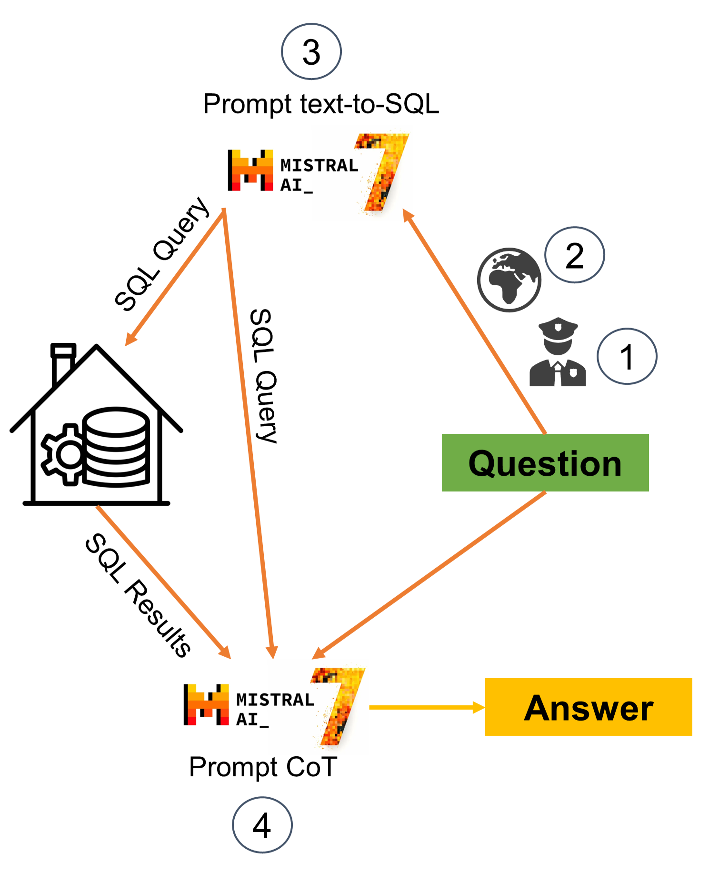

# A SQL-base Retrieved-Augmented Generation Q/Abot: MixQ/A

MixQ/At is a Q&A bot powered by [Mixtral-8x7b](https://huggingface.co/mistralai/Mixtral-8x7B-Instruct-v0.1) to interact with SQLite databases. It allows the user to be able to interact by himself with the database. It integrates advanced guardrails for enhanced security, providing a safe, efficient way to query and manage data through intuitive language commands. The agent was made with LangChain. It features a Streamlit integration for an intuitive user experience. 

Please find below the Medium article: 

 ## MixQ/A: Creating a SQL-based RAG with Mixtral-8x7B

 ### The Agent : MixQ/A
Our professor gave us the opportunity to develop a small application for job offers as part of our NLP course at the Université Lumière Lyon 2 and I thought… As an AI freeky, how could I include a bit of large language model (LLM) integration? … MixQ/A!
We retrieved multiple job offers and stored them in a data warehouse so that they were accessible to the application; nevertheless, I believe that the future of application engineering will be user-centric! So, how can the application be personalized to each user? That’s where the LLM aspect comes in; allowing the user the opportunity to query the information they desire is the solution!

Please find below the architecture of the agent:

However, a simple SQL generator isn’t the answer! There are several factors to consider, not the least of which is security.

For this project, I have chosen the LLM Mixtral 8x-7B. Why ? First and foremost, it is French, and as a French data scientist I am proud of it! Second, it is open source, and I wanted to test its capacity to handle complex jobs.

### Security is Key ! A security filter to avoid prompt injection (1)
Prompt Injection? What is that? …These are prompts designed to exploit vulnerabilities in the LLM or the agent’s overall architecture. In our situation, what happens if the user requests that the salary column be updated to “0€”? What happens if the user wishes to remove all columns? Remember that the LLM will always try to return the most likely token in this situation; it has no moral considerations (If only he could think “Delete the columns ? That doesn’t sound like a fair request to me!”).

This is may be one of the most important part of our agent…A security filter! You may ask me why is it necessary ? If we live in an utopical world, the users will be all kindly and ask specific question about job offers. But, in the real world? People will try to destroy the database 😔…

Therefore, I include a small security filter prompt, before starting to process the request, which checks whether the request is intended to alter the integrity of the database. It’s a small yes/no prompt, but it’s vitally important.

Of course, there are other considerations to take into account. In particular, before integrating the LLM, be careful with the database architecture: do not include any sensitive information (user information, etc.) in a database that is accessible to the user. Make sure that the only information available is that which is intended to be available to the user. We also need to provide access to a delayed version of our database, so that if any unwanted changes are made we can identify them before they are shared with the world.

### Correct spelling is key ! (2)
In this case in particular, correct spelling is essential for a correct SQL query! And if you’ve been to France, you may have seen that we have a lot of special characters or long province names! So we can’t expect our province names to be spelt correctly every time by the user, we have to check them.
Again, this is a simple prompt that only checks for correct spelling. But we also use it to homogenise and adapt the query to the information contained in our database: in our database, we don’t have information on cities (only on states), which allows us to modify the granularity of each question.

### Let’s interact with our Database and give the final answer ! (3 & 4)
To interact with the database, I used the LangChain SQL template (https://github.com/langchain-ai/langchain/blob/master/libs/langchain/langchain/chains/sql_database/prompt.py). Remember that the original project was in French, so I’ve used the original LangChain model and translated it into French (with some slight modifications to adapt it to my context).

Once the SQL query has been created, we may query our data warehouse to retrieve the information required to answer the user’s question. We merge the context (original question and SQL query) and answer (SQL result) into a CoT-like prompt (not entirely CoT) to improve the model’s answer.

### What’s next?!
LLMOps! As any machine learning model, it is not just modelizing data and letting him living freely. We must have to continuously check how the model behave globally and specifically with our database. These are among several points that we must check:

- Question that generates non-fonctionnal SQL queries: This will allow us to refine our text-to-SQL prompt or add a filter/corrector before translation.
- Most recurrent information queried: If we already know what most users want, we can make it easier for them to access or even integrate this information into our dashboard/application.
- Any database integrity alteration: As with any application, we need to ensure that the database is not altered, and if someone has done it (and there is always someone who can), we need to understand how it was done and adapt our filter to counteract it.
- Improve the consistency of our prompts: There are a number of prompt engineering techniques that can be used to achieve this aim such as self-consistency prompts (https://arxiv.org/abs/2203.11171, more on this in future articles, stay tuned!).
- Measuring the performance of our agent: As with any machine learning model, we need to monitor its performance over time to ensure that its answers are correct. We can use a simple check of another prompt (“Did the answer <answer> answer the query <query>?” or “Is this SQL query <query_SQL> the translation of this question <question>?”). We can also use more advanced evaluation techniques, such as the RAGAS score(https://blog.langchain.dev/evaluating-rag-pipelines-with-ragas-langsmith/).
- Using user feedback to higlight inadequate queries: If we add a small button to allow users to give us their feedback, we can identify questions (or SQL queries) that don’t work and improve our prompts.

### Conclusion
This project demonstrated how we can use a combination of SQL and natural language to provide more context-specific answers. It highlights the significance of focusing not just on “retrieving information and generating an answer” but also on hidden key factors like security, spelling, and follow-up.

